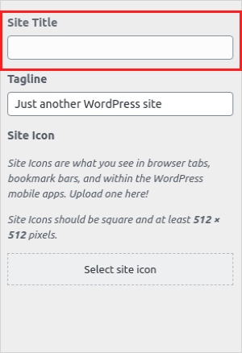
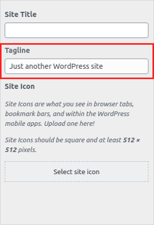
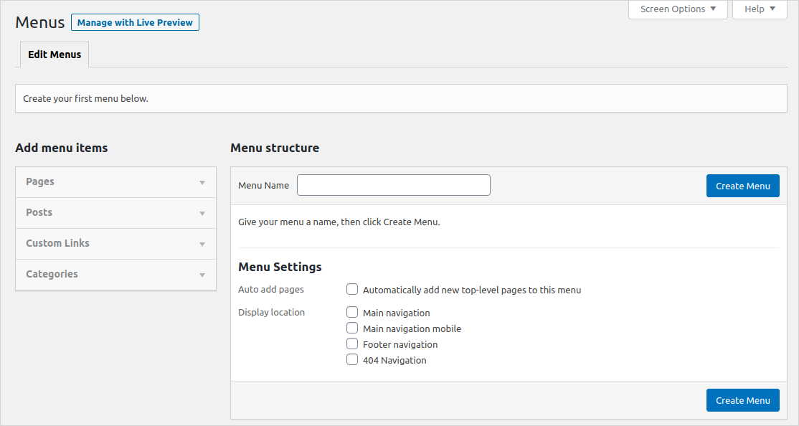
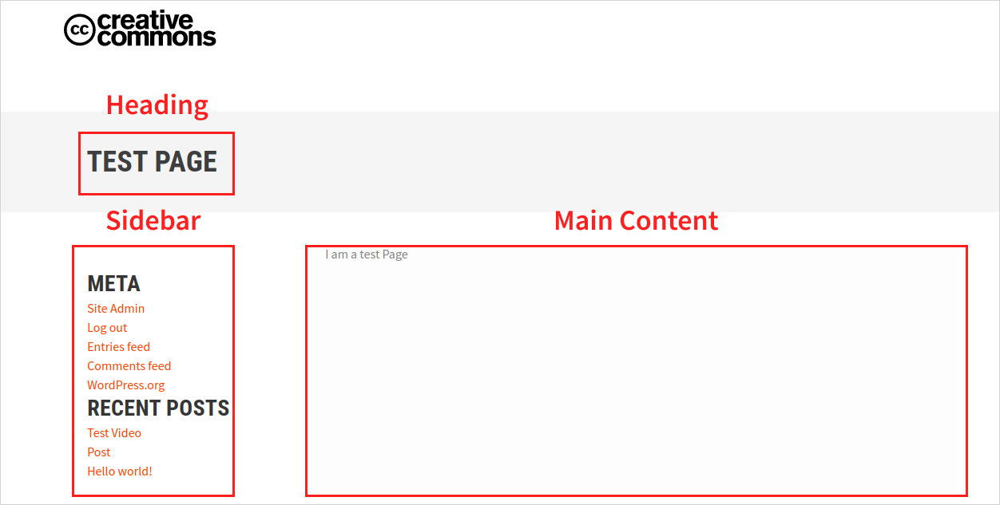
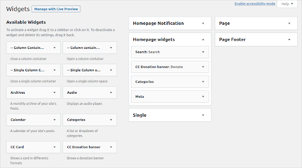
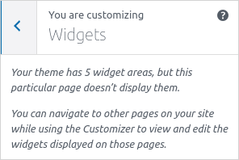
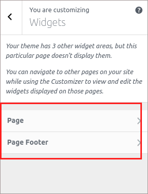
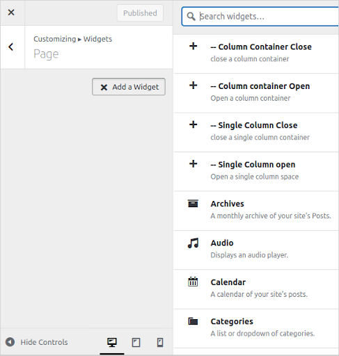

## Custom Title

### To add a custom title:

- Go to **Customize** > **Site Identity** 
- In the field labeled **Site Title** enter a custom title of your site.

<

## Custom site description or tag line

### To add a custom site description or tagline:

- Go to **Customize** > **Site Identity** 
- In the field labeled **Site Tagline** enter a custom tagline(or description) of your site.

## Custom Icon

### To add a custom icon:

- Go to **Customize** > **Site Identity** 
- Click the button labeled **Select Icon** to set up an icon.
Note that the site icon must be a square that is 512 x 512 pixels.

## Custom Navigation Menus

There are two menu locations in the site which are namely: Main Navigation and Footer Navigation. 

The screenshot below shows an example of a custom menu in the Main Navigation:

The screenshot below shows an example of a custom menu in the Footer Navigation:

_The menus shown above are displayed in the desktop view. On any other screens, their appearance and or position might be different from what is shown above._

### To create a custom menu using the customize panel:

- Go to **Customize** > **Menus** and click the **Create a Menu** button. You will be redirected to a form with a field labeled **Menu Name**.
- Fill that field with a unique menu name.
- Select the menu location
- To proceed to the next step in the form, click the button labeled **Next**.
- Then click the button labeled **+Add Items**, it will reveal all of the items which can be included in the menu.

- Select menu items by clicking on them. 
- You are able to re-order the arrangement of selected menu items by dragging them up and down.
- After you are done you may proceed to publish the changes.

### To create a custom menu using the dashboard:

- Go to **Dashboard** > **Appearance** > **Menus**, the form in the diagram above will be shown.
- Enter the menu name in the filled labeled **Menu Name**.
- Select the menu **Display location** under **Menu Settings**.
- Then click the button labeled **Create Menu**.
- Add menus items from those that are displayed on your left.
- Then save your changes.

**Nested Menus**

The theme design supports two levels of nesting.

## Custom Pages

### To create a page:

- Go to **Dashboard** > **Page** > **Add New**
- On the right side of your editor in the sidebar, you will find different settings you may use to configure your page. If the sidebar is not shown, click on the Settings icon on the upper right corner of your editor
- To set the page layout, go to **Document** > **Page Attributes** > **Template**, you will see three available layouts displayed select one that meets your requirements. To learn more about page layouts see the  next section.
- Publish your changes.

### Page Layouts

There are three layouts in the theme you can use to configure the structure of your pages. The layouts are:

#### Default Layout

This is the default layout of the page template, it has a default sidebar component on the left. To populate the sidebar with widgets:

- View the page on the **Live Preview**
- Go to **Customize** > **Widgets** > **Page**
- View the <g-link to="/customizations#widgets">Widgets</g-link> section to learn how you can configure the widgets.

#### No Sidebar Layout

This layout is structured like the Default layout but it does not have the sidebar component. Otherwise, everything else is the same.

#### Homepage Layout

As its name implies, this layout was created to serve as a template for a custom Homepage, but it can also be used to structure any other static page depending on your preferences.

The Homepage Layout was designed to be populated with content through the use of widgets. You cannot use the Gutenberg editor to add content in the Homepage Layout.

Check out the <g-link to="/customizations#widgets">Widgets</g-link> section to learn how you can use widgets to add and position content in the Homepage Layout.

### Custom Homepage

By default, the homepage will display the latest blog posts.
In order to display a static page on the homepage:

- Create a page and set it to use the Homepage Layout. Give the page a title (e.g **Homepage**).
- Create another page and give a title of your choice(e.g. Blog).
- Go to **Dashboard** > **Settings** > **Reading**, and set your homepage display to the static page. Then set your Homepage to display the Homepage(the static page we created above) and set your posts to be displayed on the Blog page.

- There are other optional settings outlined in the **Reading Settings** which you can use to also manage your site.
- When done, click the button labeled **Save Changes**.

#### To add a Hero Image in a Custom Homepage:

- Go to **Dashboard** > **Custom Settings**
- Select **Yes** to **Enable featured content on homepage?**
- Then click the **Upload** or select an existing image button.
- After clicking the **Upload or select an existing image** button you will be redirected to the Media Library. Select a suitable image from the media library or upload an image from your computer. 
- After successfully uploading a hero image you may choose to add **Content over the image**.
- Other optional features that can be incorporated in the hero include a **Background Color**, **CC Donate Button**, **Authors Posts**, and a **Notification Button**.
- Click the **Submit** button to publish your changes.

#### To add content to a Custom Homepage

- See the Widget Section.

## Custom Posts

### To create a post:

- Go to **Dashboard** > **Posts** > **Add New**
- On the right side of your editor in the sidebar, you will find different settings you may use to configure your post. If the sidebar is not shown, click on the **Settings** icon on the upper right corner of your editor.
- To change the post format of your post:
    - Open Settings
    - Select the Document tab
    - You will find Post Format listed in the Document settings.
    - Select your desired Post format from the dropdown:
    
    - Close the Settings by clicking on the gear icon.
    - On your editor at the very bottom of your post, click on the Post Format Panel so as to enlarge it.
     
    - Add relevant configuration details which will be influenced by the format you selected in the Settings.

### Post Formats

There are four formats available in the theme which can be used to configure the layout of your posts. The formats are:

#### Standard

- This is the default format of the posts.

#### Video

- This format will enable you to embed videos into the Post page. It has support for both YouTube and Vimeo. The video will appear at the very top of your page.

#### Gallery

- This format will enable you to embed an image gallery in your post. The embed image gallery will appear at the very top of your page.

#### Image

- This format will enable you to embed a featured image in your post. The embed image will appear at the very top of your page.

_If the above-listed post formats do not meet your requirements, you can completely override the post template by using partials._

## Widgets

The widgets are available in **Dashboard** > **Appearance** > **Widgets**. On the left panel, we have the available widgets and the small panels on the right are the widget areas available in the theme.

 

### To add a widget:
- Drag it from the left panel into a widget area and provide the configuration information if it is required.
- The selected widgets can be re-ordered by dragging them up and down within the selected widget area panel.

### To remove a widget:
- Drag the widget back to the Available Widgets panel. If you want to save the settings of your widget drag it to the Inactive Widgets instead.

### To add widgets using the Customize panel:

- Go to **Customize** > **Widgets**. If you are on a page that does not have any widget areas you will get a message shown in the screenshot below:

When the page has widgets areas they are listed as shown in the screenshot below:

- You select a widget area by clicking it. 
- To add widgets click the +Add Widget button and then select a widget from the widget panel on your right.
- You are also able to search for widgets in the event the one you need is not displayed.

- After adding widgets you can then publish your changes.

_To learn more about widgets view the <g-link to="/advanced-customizations#advanced-widgets"> Advanced Widgets</g-link> section._
